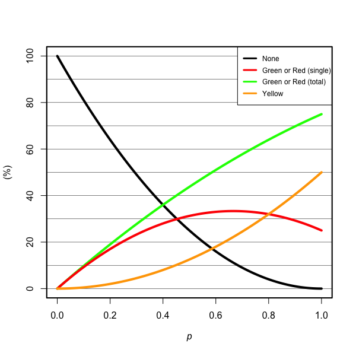
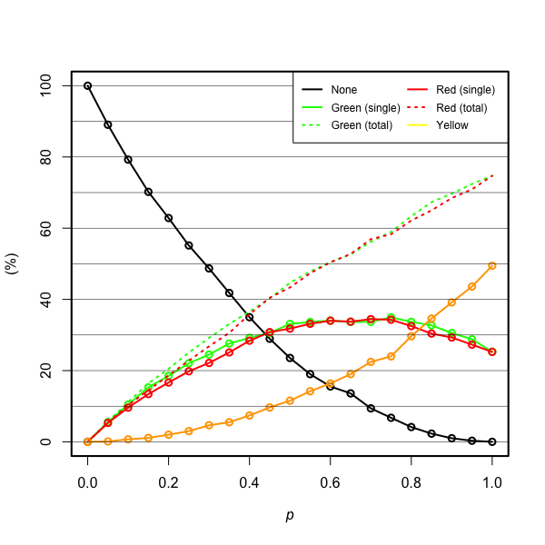

# dualknockin

Model of CRISPR-induced dual knock-in

## Results

-   Theoretical plot 

-   Probabilistic simulation 

## Reference

-   Tsunekawa, Y., Terhune, R. K., Fujita, I., Shitamukai, A., Suetsugu
    T., and Matsuzaki. F. Developing a de novo targeted knock-in method
    based on in utero electroporation into the mammalian brain.
    *Development* **143**, 3216–3222 (2016).
    [DOI:[10.1242/dev.136325](DOI:%5B10.1242/dev.136325){.uri}](http://dx.doi.org/10.1242/dev.136325).
